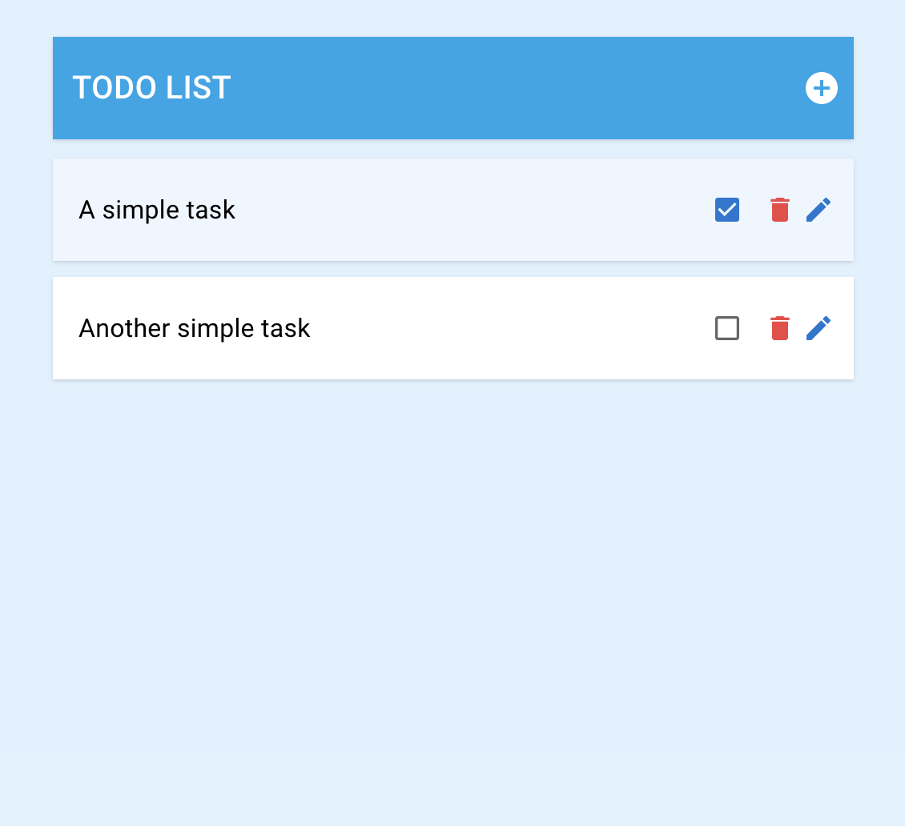
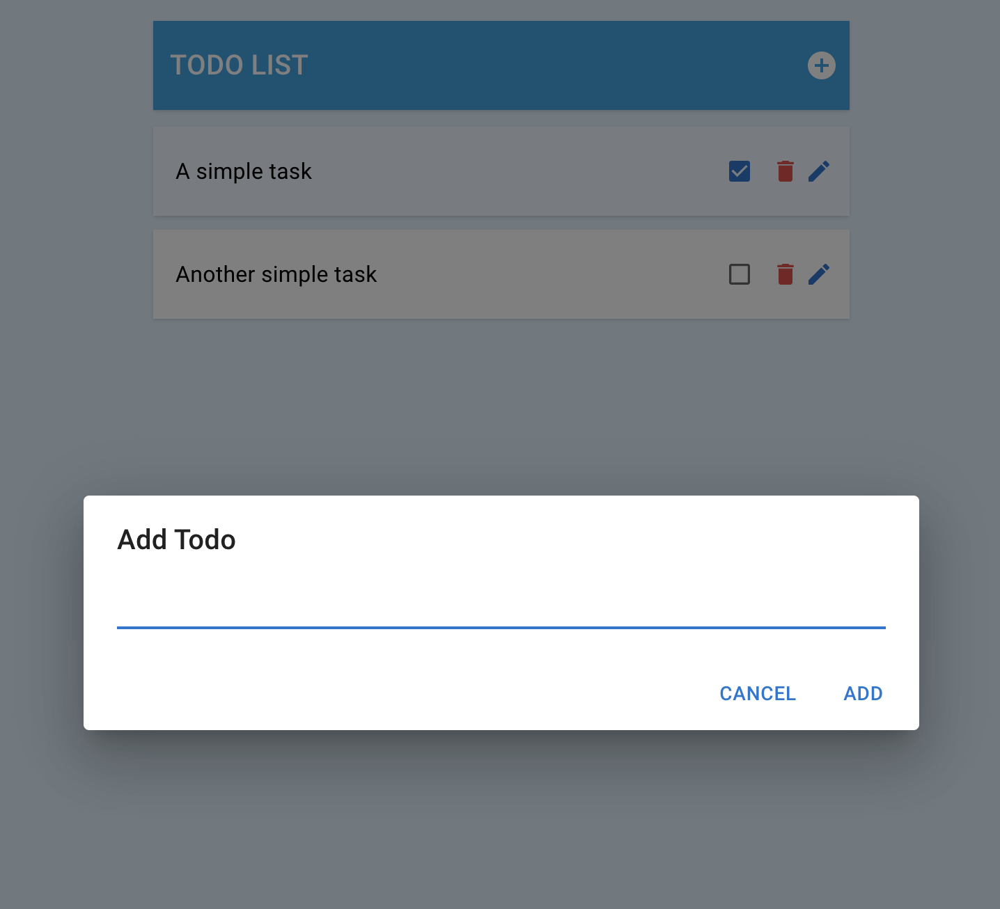
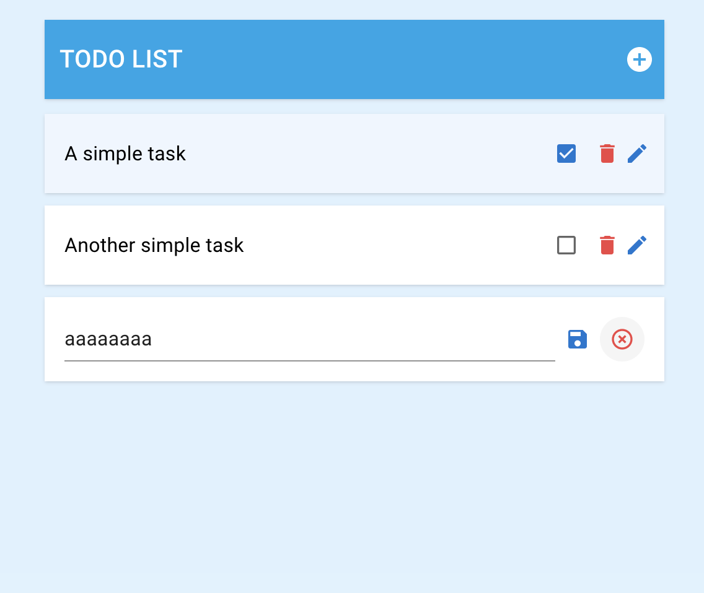
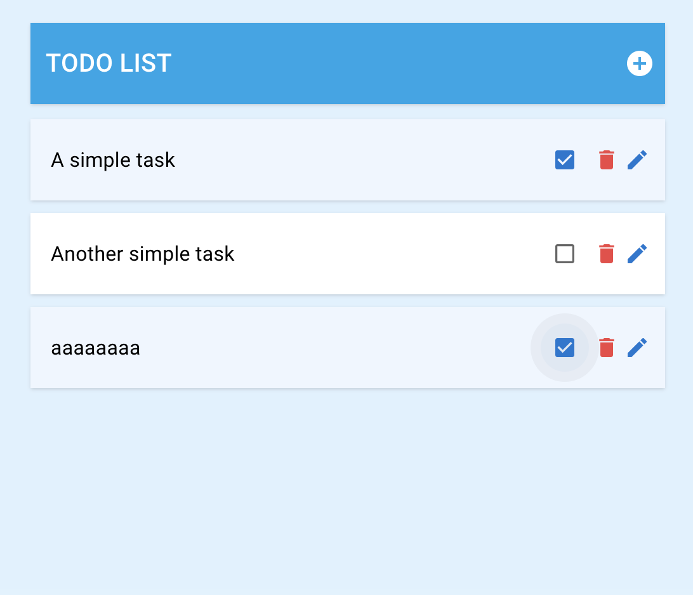

# Ascella Code Challenge - ToDo List React App (Hooks)

This project was bootstrapped with [Create React App](https://github.com/facebook/create-react-app).

## How to run scripts

### 1. Install all dependencies by running this command on Terminal

#### `npm install`

### 2. Start app by running this command on Terminal

#### `npm start`

### 3. Test app in the development mode

Open [http://localhost:3000](http://localhost:3000) to view it in your browser.

## Screenshots

### ToDo List

### Add ToDo

### Edit ToDo

### Complete ToDo

### Delete Todo

Screenshot not attached

## Notes

First I built this simple app using React Hooks because Redux could cost expensive for this kind of simple app.\
But for Redux skill demonstration I built once again using Redux and you can find the source from this link.\
[https://github.com/mastersolutioncode/ascella-challenge-todo-redux](https://github.com/mastersolutioncode/ascella-challenge-todo-redux)
